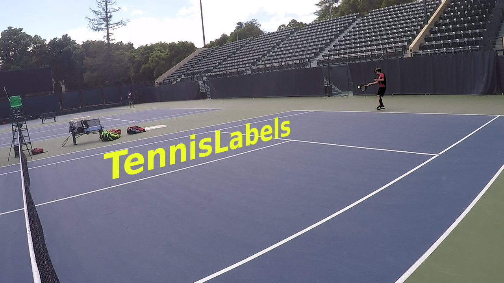

# tennisLabels

This repository is a collection of tasks and utils to work with CVAT annotation tool
to annotate tennis videos.

At the moment, it only has one util script -- it converts CVAT XML to PASCAL VOC XML. Use
[my fork of opencv/cvat](https://github.com/maheriya/cvat) instead of using converter from original opencv/cvat if you want to use 'pose' and 'truncated' attributes.

I have stored a task description used to create example annotations in the annotations directory. These are
only for reference.
